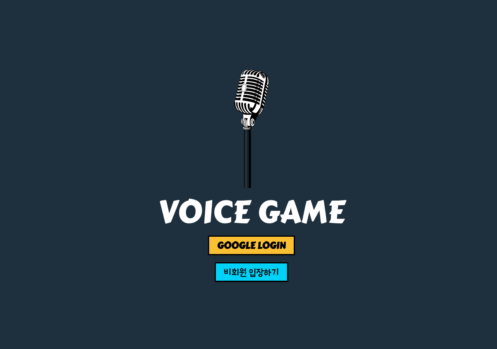
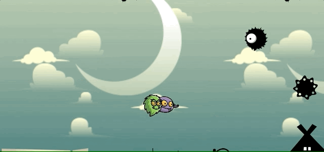
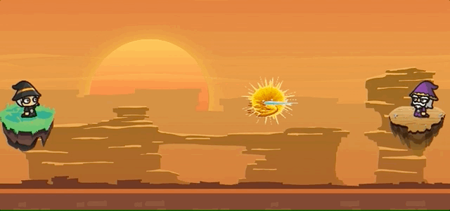

# 🎙🎙 **Voice Game** 🎙🎙



## 📌 &nbsp; What is Voice Game?

Voice Game은 사용자의 목소리를 이용해 즐길 수있는 미니 게임들로 으로 구성되어 있으며, 크롬 브라우저에서 즐길 수 있습니다.

### 🕹 &nbsp; **[Play Voice Game](https://voicegame.fun)**

<br>

## 📌 &nbsp; Game Overview

### **`Little Forest`**

음정 높낮이로 길을 만들고, 지형을 움직여 고슴도치를 목표 지점까지 보내는 게임입니다.


### **`Monster Escape`**

소리 크기로 적 몬스터들을 피해 요괴 소굴을 탈출하는 게임입니다.

 

### **`Energy Battle`**

소리 크기로 에너지파를 만들어 승부를 가르는 대전 게임입니다.

 

<br>

## 📌 &nbsp; Github Repository

📁 &nbsp; [**Frontend** Repository](https://github.com/voice-game/front)

📁 &nbsp; [**Backend** Repository](https://github.com/voice-game/back)

<br>

---

<br>

## Project Description

🤔 &nbsp; [Motivation](#-Motivation)

📆 &nbsp; [Schedule](#-Schedule)

🧑🏻‍💻 &nbsp; [Contributor](#-Contributor)

🛠 &nbsp; [Stack](#-TechStack)

🔎 &nbsp; [Feature](#-Feature)

🧗‍♀️ &nbsp; [Challenge](#-Challenge)

✍️ &nbsp; [History](#-Hisotry)

🙇🏻‍♂️ &nbsp; [Conclusion](#-Conclusion)

<br>

---

<br>

## Motivation

팀원 모두의 게임 제작과 Canvas에 대한 흥미로 게임을 주제로 결정하였습니다.

보다 특색있는 게임을 만들어보고자 음성인식 기반으로 조작되는 게임을 아이디어로 채택했습니다.

- 영감을 받은 게임 [One Hand Clapping](https://www.youtube.com/watch?v=gRGI1Oj9wFc)

사용자의 음성을 다양하게 활용하기 위해서 목소리의 크기와 높낮이로 나누어 3가지 미니게임을 제작하게 되었습니다.

- 높낮이, 크기, 높낮이와 크기

<br>

## Schedule

### **`2021.04.12~04.30 총 제작기간 21일`**

### **`1주차` - 설계 단계**

- 프로젝트 주제 선정
- Mock-Up 제작 [Mock-Up 보러가기](https://www.notion.so/canwefly89/Voice-Game-Mock-Up-38e0618894534a5c926a288ca185e467)
- DB-Schema 및 Redux State 구조 설계
- 구현 가능 여부 검토
  - 음성 인식 Web API 스터디
  - 주파수 인식 라이브러리 탐색
  - Canvas 기초 스터디
- 공통 컴포넌트 제작
- DB 연결 및 라우팅 기초 설계

### **`2주차` - 구현 단계**

**Front End**

- 게임별 컴포넌트 제작
- 기능 구현
  - Audio Context(Web Api) 이용하여 음성 인식 기능 구현
  - Canvas Animation 구현
  - Socket 통신 구현
- 게임 구현
  - Sprite Image 제작
  - 게임별 움직임 및 충돌 로직 등

**Back End**

- Data 연결 및 방-유저 상호작용 설계
  - Pusher로 방 변화 상태 실시간 전달

### **`3주차` - 마무리 단계**

- 구현 마무리
  - 게임 완성도를 위한 게임 내부 엣지케이스 핸들
  - 게임 맵 및 상호작용 추가 (little forest)
  - 방-유저 상호작용 이벤트 관련 엣지케이스 핸들
  - UX 향상을 위한 이미지 로딩 과정 최적화 (Loading Page 추가)
- 리팩토링
  - 전체 코드 일관성 유지
  - Prop-types 추가
- 테스트 코드 작성
- 프론트엔드, 백엔드 배포
  - Netlify, AWS Elastic Beanstalk

<br>

## Contributor

### **`서성주`**

서성주의 역할에 대해 쓰면 됩니다.

### **`권민호`**

권민호의 역할에 대해 쓰면 됩니다.

### **`김재덕`**

김재덕의 역할에 대해 쓰면 됩니다.

<br>

## TechStack

<details>
  <summary><span style="font-size: 16px; font-weight: 600">Front End</span></summary>
  <div markdown="1">

| Stack                 | Remarks                                              |
| :-------------------- | :--------------------------------------------------- |
| ES2015+               | -                                                    |
| React                 | MERN-STACK 기반 구현                                 |
| React-router-dom      | -                                                    |
| Redux-thunk           | Redux Store 비동기 작업 (서버요청, 이미지 로딩) 관리 |
| Styled-components     | 공통 컴포넌트 재사용성                               |
| Firebase              | Social Login 구현                                    |
| Socket.io-client      | 멀티플레이를 위한 실시간 통신                        |
| Pusher-js             | 실시간 DB 변화 구독                                  |
| Jest                  | React Component Test                                 |
| Enzyme                | React Component Test                                 |
| React-testing-library | TBD                                                  |
| Redux-logger          | TBD                                                  |

  <br>
  </div>
</details>

<details>
  <summary><span style="font-size: 16px; font-weight: 600">Back End<span> </summary>
  <div markdown="1">

| Stack                | Remarks                       |
| :------------------- | :---------------------------- |
| NodeJS               | JavaScript Runtime으로 npm    |
| Express              | JavaScript 서버 애플리케이션  |
| MongoDB              | MERN-STACK 기반 구현          |
| Mongoose             | MongoDB JavaScript ODM        |
| JWT (JSON Web Token) | 토큰 기반 인증                |
| Soket.io             | 멀티플레이를 위한 실시간 통신 |
| Pusher               | 실시간 DB 변화 알림           |
| Mocha                | 서버 엔드포인트 테스트        |
| supertest            | 서버 엔드포인트 테스트        |
| AWS                  | TBD                           |

  <br>
  </div>
</details>

<br>

## Feature

### **`Game Platform`**

### **`Little Forest`**

### **`Monster Escape`**

### **`Energy Battle`**

<br>

## Challenge

### **`Volume Meter`**

미니 게임 Monster Escape와 Energy Effect는 소리 크기를 게임 입력으로 받아, 게임 내 캐릭터를 조작합니다. 이전에 음성인식을 해주는 Web Speech API 사용했던 경험이 있었기에, 볼륨 측정 또한 Web API에 있을 것이라 판단하였습니다. 하지만 기대와 달리 Web API는 마이크 데이터만 센싱할 뿐 별도의 볼륨 측정 기능은 없었기에 게임 주제를 바꾸어야하나 고민하였습니다. 하지만 Web API가 Audio Context 객체를 통해 마이크 입력을 FFT로 계측해주기 때문에, 이를 프로세싱하여 볼륨 측정 함수를 만들기로 하였습니다. FFT(Fast Fourier Transformation)란 시간영역의 디지털 신호를 주파수 영역에서 분석하는 기법입니다. 따라서 <span style="color: blue">FFT를 통해 마이크에 들어온 플레이어의 목소리를 주파수별 크기로 분해하고 이들을 가공하여 볼륨을 구할 수 있었습니다.</span> 처음에는 개념이 낯설어 프로젝트를 진행하는데 어려웠지만, 프로그래밍을 통해 다양한 분야를 접하고 더나아가 구현할 수 있었던 점이 흥미로웠습니다.

### **`Pitch Detector`**

**Audio Context (Web Api)**  
음성인식을 위해 Web Api로 제공되는 Audio Context를 사용하였습니다.
다만, Audio Context의 AnalyserNode를 통해 얻을 수 있는 주파수 데이터가 FFT로 변환되어 제공되는데 이를 원하는 형태로 가공하여 사용하는 것에 어려움이 있어 MIT의 Pitch Detector의 Source Code를 가공하여 사용하였습니다.

### **`Canvas`**

게임 플레이 화면을 보여주기 위해, Javascript를 기반으로 HTML에 다양한 애니메이션을 보여줄 수 있는 Canvas를 사용하였습니다. 원하는 선/도형/이미지를 그리고, 애니메이션 효과를 넣기 위해 requestAnimationFrame함수를 재귀로 실행하는 등 Canvas 개념 자체는 어렵지 않았습니다. 하지만 게임 특성 상 아래와 같이 다양한 상황(점프 & 낙하 / 횡이동 & 종이동 / 충돌 & 접촉 / 캐릭터 사망 등)이 있었기에, 이들을 고려하여 어떻게 Canvas에 그릴지 로직을 만드는 것에 어려움이 있었습니다.

- 생동감 있는 게임 캐릭터 구현을 위해 Sprite 이미지를 사용하였기 때문에, 기본 60fps로 실행되는 requestAnimationFrame 함수에서 이미지 프레임에 맞게 Canvas Drawing이 실행되도록 <span style="color: blue">프레임 제어 로직</span>이 필요했습니다.
- 캐릭터가 점프를 했을 때 아래와 같은 과정을 거치기 때문에, Canvas Y 축(수직 축)에 대해 동역학 모델링에서 사용되는 <span style="color: blue">중력모델</span>을 구현해야 했습니다.
  ```
  점프 → 빠르게 올라감 → 점점 느려짐 → 멈춤 → 느리게 떨어짐 → 점점 빨라짐 → 착지
  ```
- 지면 접촉 및 장애물 충돌 구현을 위해 캐릭터 좌표(x, y)와 지면 및 장애물 좌표를 다앙햔 경우를 고려하여 로직을 만들어야 했습니다.
- 멀티플레이를 할 경우, 플레이어마다 브라우저 화면의 크기가 다르기 때문에 소켓통신에 절대좌표를 보내면 캐릭터가 이상한 위치에 그려지게 됩니다. 따라서 캐릭터 위치를 Canvas 크기에 대해 정규화하여 소켓통신을 해야했습니다.

이처럼 Canvas를 다루는게 까다롭고 어려웠지만, 게임, 웹 디자인 등에 쓰이는 Canvas의 활용도에 대해 배울 수 있었던 좋은 경험이었습니다.

### **`Socket IO`**

...  
[방장이 나간 사실을 어떻게 감지할까? - socket.io](https://www.notion.so/canwefly89/disconnect-leave-socket-io-950fbef3ed9a4c789f4e850af2dad3e7)

### **`객체 지향 프로그램`**

...

### **`움직이는 이미지 만들기`**

...  
[움직이는 이미지 만들기](https://www.notion.so/canwefly89/sprite-Images-35c0cfc34e5340c1933d91f504a0a8f7)

### **`이미지 저장 위치`**

이미지가  
[이미지를 어디에 저장할까?](https://www.notion.so/canwefly89/AWS-S3-download-files-import-from-public-in-react-8eb1c34ddc0949b5b0d61af055e3aea4)

### **`Custom Hook`**

...

<br>

## Deploy

### **`Frontend`**

Netlify 배포 관련 내용

### **`Backend`**

AWS 배포 관련 내용

<br>

## History

영상으로 넣는다면 주차별로 구분하지 않아도 괜찮을 것 같습니다.

<br>

## Conclusion

### **`서성주`**

서성주의 마무리 멘트

### **`권민호`**

권민호의 마무리 멘트

### **`김재덕`**

캔버스 로직이 vanilla javascript로 되어 있고 각각의 요소들이 독립적이어야 했기 때문에 평소보다 OOP에 더 신경을 써야 했습니다. 어려움도 많이 느꼈지만 OOP의 확실한 장점을 전보다 더 체감할 수 있는 계기가 되었습니다.

<br>

## Contact

### **`서성주`** canwefly89@gmail.com

### **`권민호`** minhob38@gmail.com

### **`김재덕`** jdcoder9@gmail.com
