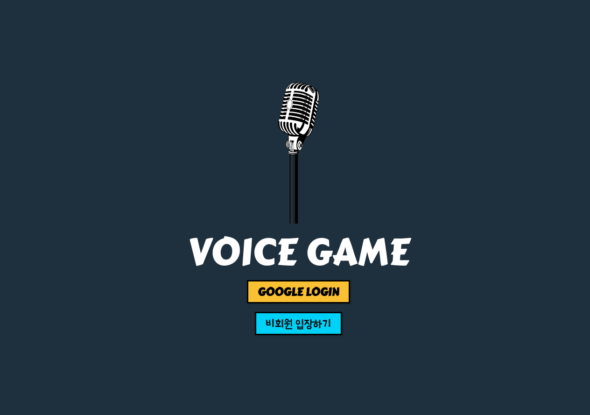

# 🎙 Voice Game !


voice game은 플레이어의 음성을 인식하여 플레이 할 수 있는 3가지의 미니 게임입니다.
- Little Forest
- Monster Escape
- Energy Battle

<br>

## Link

[Voice Game](https://voicegame.fun/)

<br>

## 📖 Contents
---
- 🤔 [Motivation](#-Motivation)
- 🥁 [Preview](#-Preview)
- 📆 [Schedule](#-Schedule)
- 🛠 [Stack](#-Stack)
- 😃 [Installation](#-Installation)

<br>

## 🤔 Motivation
---
팀원 모두 게임 제작에 대한 흥미가 있어 게임 제작을 결정하게 되었습니다.

서비스되고 있는 게임 중 음성인식 기반의 게임에 영감을 받아  
음성을 다양하게 활용하기 위해서 음의 크기, 음의 높이 등으로 나누어 3가지 게임을 제작하였습니다.

<br>

## 🥁 Preview
---
<p>
  
  
  
</p>

<br>

## 📆 Schedule
---
2021.04.12 - 04.30 / 3주

- 1주차 - 프로젝트 주제 선정, Mock-Up 제작, DB-Schema 설계, 구현 가능 여부 검토
- 2주차 - Audio Context(Web Api) 이용하여 음성 인식 기능 구현, Canvas Animation, Socket 통신 구현
- 3주차 - Netlify & AWS 배포, 테스트 코드 작성, 코드 리팩터링

<br>

## 🛠 Stack
---
| Front-end              | Back-end                |
| :--------------------- | :---------------------  |
| ES2015+                | NodeJS (Express)        |
| React                  | MongoDB                 |
| React-router-dom       | Mongoose                |
| Redux-thunk            | JWT (JSON Web Token)    |
| Redux-logger           | Soket.io                |
| Firebase               | Pusher                  |
| Styled-components      | Mocha                   |
| Socket.io-client       |                         |
| Pusher-js              |                         |
| Jest                   |                         |
| React-testing-library  |                         |
| Enzyme                 |                         |

<br>

## 😃 Installation
---
Git Hub를 통해 플레이 해보실 수 있습니다.

### Front
```jsx
$ git clone https://github.com/voice-game/front.git
$ npm install
$ npm start
```

### Back
```jsx
$ git clone https://github.com/voice-game/back.git
$npm install
$ npm start
```

## 🧗‍♀️ Challenge

---

Audio Context (Web Api)

- 음성인식을 위해 Web Api로 제공되는 Audio Context를 사용하였습니다.
볼륨과 주파수 2가지 정보가 필요했는데
볼륨의 경우는 Adio Context가 변화가 적은 지속적인 음에 대한 인식이 끊어지는 문제
주파수의 경우 Audio Context를 통해 얻을 수 있는 
FFT(고속 푸리에 변환)으로 분석된 주파수 정보를 가공하여 사용하는 것에서 문제가 생겼다.

이를 해결하기 위해
~~

Canvas

- 

Socket.io

- 

AWS

- 

## ✍️ History

---

## Deploy

---

- AWS

- Netlify

## ✨ Contributor

---
